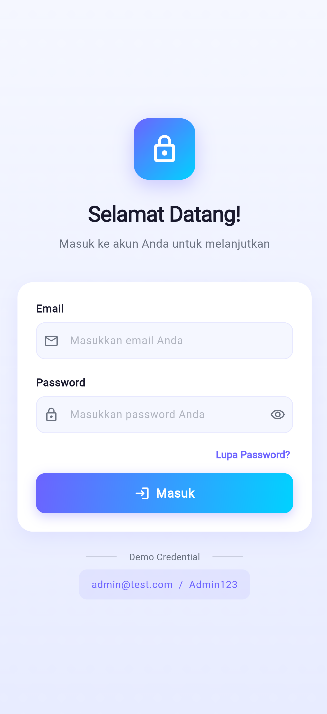
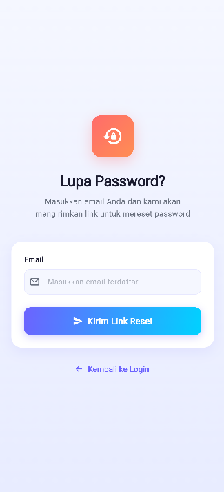
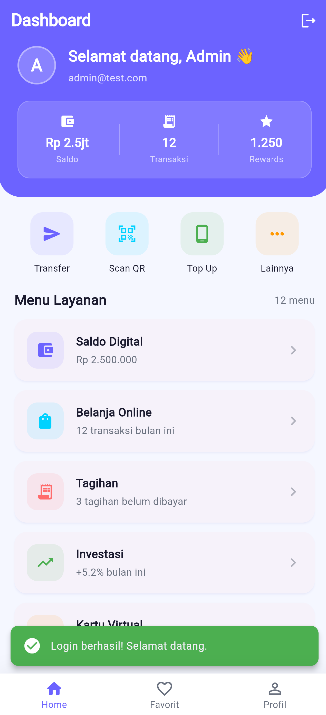

# Jiwa UTS - Aplikasi Flutter 3 Halaman

Aplikasi Flutter yang dibangun sebagai tugas UTS (Ujian Tengah Semester) mata kuliah Mobile Programming.

## 1. Deskripsi Aplikasi

Aplikasi ini mengimplementasikan konsep-konsep dasar Flutter dari Pertemuan 1 sampai Pertemuan 5, meliputi widget dasar, layout, navigasi, state management, dan validasi form. Aplikasi terdiri dari 3 halaman utama:

- Login Screen: Form login dengan validasi email dan password, state management (isLoading, errorMessage, isPasswordVisible), dan mock authentication.
- Lupa Password Screen: Form reset password dengan validasi email dan feedback visual berupa Dialog dan SnackBar.
- Dashboard Screen: Halaman utama setelah login dengan greeting user, ListView.builder, Card widgets, dan BottomNavigationBar.

## 2. Daftar Fitur

### Halaman 1 - Login Screen
- Form login dengan field Email dan Password
- Validasi client-side menggunakan Form, TextFormField, dan GlobalKey<FormState>
- Validasi email: tidak boleh kosong, format email (regex)
- Validasi password: tidak boleh kosong, minimal 8 karakter, mengandung huruf dan angka
- State management: isLoading, errorMessage, isPasswordVisible
- Tombol Login dengan loading indicator
- Toggle show/hide password
- Link "Lupa Password?" dengan Navigator.pushNamed
- SnackBar untuk pesan error dan success
- Navigasi ke Dashboard setelah login sukses
- Mock credential: admin@test.com / Admin123

### Halaman 2 - Lupa Password Screen
- Form input email dengan validasi format
- Tombol "Kirim Link Reset" dengan loading state
- Feedback visual: SnackBar dan Dialog setelah tombol ditekan
- Tombol "Kembali ke Login" menggunakan Navigator.pop
- Layout widgets: Column, Padding, SizedBox, SafeArea

### Halaman 3 - Dashboard Screen
- AppBar dengan judul dan tombol logout
- Tampilan data user yang login
- ListView.builder dengan 12 item dummy dalam Card
- Card dengan styling (shadow, rounded corner, padding)
- Logout menggunakan Navigator.pushNamedAndRemoveUntil
- BottomNavigationBar dengan 3 tab (Home, Favorit, Profil)
- Quick action buttons dan Summary card (Saldo, Transaksi, Rewards)

## 3. Cara Menjalankan Aplikasi

Prasyarat:
- Flutter SDK (stable terbaru)
- Android Studio / VS Code
- Emulator atau device fisik

Langkah-langkah:

1. Clone repository
   ```bash
   git clone <URL_REPOSITORY>
   ```

2. Masuk ke direktori project
   ```bash
   cd jiwa_uts
   ```

3. Install dependencies
   ```bash
   flutter pub get
   ```

4. Jalankan aplikasi
   ```bash
   flutter run
   ```

## 4. Screenshot Ketiga Halaman

### Halaman 1 - Login Screen


### Halaman 2 - Lupa Password Screen


### Halaman 3 - Dashboard Screen


## 5. Daftar Package yang Digunakan

- flutter (SDK): Framework utama
- cupertino_icons (^1.0.8): Icon style iOS

Catatan: Aplikasi ini hanya menggunakan package bawaan Flutter tanpa package pihak ketiga tambahan, untuk mendemonstrasikan pemahaman penuh terhadap widget dan fitur native Flutter secara murni.
